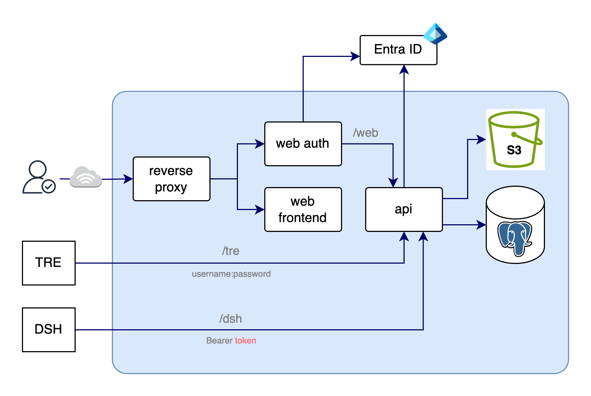

# The ARC Services Portal

What went well, what didn’t go so well, lessons learned.

## First: what is it? {data-menu-title="First: What is it? (i)"}

- Management interface + datastore for UCL's Information Governance Assurance function
- Replacing existing portal which has been running for >10 years
- Source of truth of unique identifiers, approval status, privileged roles for all registered research involving sensitive data at UCL
- Current Portal built with SharePoint lists as the datastore, workflows and logic built with Power Automate

## First: what is it? {data-menu-title="First: What is it? (ii)"}

A 3-tier web app following Twelve-Factor App thinking

- Go for backend services
- React (NextJS) for the frontend
- Docker for containerized development and deployment
- Nginx as a reverse proxy in dev
- PostgreSQL as the database
- Cypress for end-to-end testing
- S3 for object storage

## First: what is it? {data-menu-title="First: What is it? (iii)"}

Runs on EKS in production, expected to serve 1000s of users:

- Fronts UCL's Trusted Research Envrionments
  - User registration and profile creation
  - Study creation: information governance construct for assurance and compliance
  - Project creation and management: to access resources in technical envrionemnts

## First: what is it? {data-menu-title="First: What is it? (iv)"}

- But: extensible to allow reuse of profile for more UCL computing services
  - Research Data Storage Services
  - Electronic Research Notebook

## First: what is it? {data-menu-title="First: What is it? (v)"}

{fig-align="center"}

## Information at beginning

- High level functional requirements well defined
- Implementation of existing portal *very* murky
  - Maintainer of portal left UCL in June 2025
  - Wasn't even the original creator
- Serious data quality issues in existing portal
- Development resource constrained

## The Ambition

> Create a tool which not only helps users and UCL satisfy regulatory and statutory obligations, but a tool that is genuinely useful and facilitates better research outputs.

## Where are we now?

The ARC Services Portal is live: 

::: {.fragment style="text-align: center"}
[https://portal.arc.ucl.ac.uk](https://portal.arc.ucl.ac.uk)
:::

- Users profile and onboarding functionality ✅
- Study creation, review & approval, management ✅
- Project creation, management 🛠️

::: {.fragment}
Data migration time...
:::

## Migration Options

:::: {.columns style="display: flex; justify-content: space-between; margin-top: 2em;"}

::: {.column style="flex: 1; margin: 0 0.3em;"}

**Symmetrical incremental**

Least pressure on devs, most fragmented UX

☹️

:::

::: {.column style="flex: 1; margin: 0 0.3em;"}

**Asymmetrical incremental**

ARC TRE first, perhaps middle path for all

🙃

:::

::: {.column style="flex: 1; margin: 0 0.3em;"}

**Big bang: all at once**

Best for users, worst for developers!

🥴

:::

::::

# Migration TBC...

# What went well?

## 1. Clear communication among a capable team

::: {.fragment}
Really natural blend of **Agile**, **Scrum** and **Kanban** 
  
  → this is how development frameworks are best used
:::

- Standups, sprint planning, focused issue-driven feature development

## 2. Fast feedback in ignorance of current platform's internals

::: {.fragment}
It's difficult to replace a piece of software:
:::

- Users are familiar with the existing system
- Users dislike some things - but love other things!
- Tension between these two things needs careful management
- Many stakeholders: Info Gov admins, TRE Ops staff, compliance teams, portal developers, senior leadership, service owners... and users!

## 3. Success in achieving consensus on difficult design choices

- Options papers
- Endorsement from Design Authorities
- Justified departure from strategic heuristics
- Triumph of adverserial and open discussion

# What didn’t go so well?

## 1. Detail in issues peaked and troughed

::: {.fragment}
Often team members on the same page, but sometimes not:
:::

- Pick up an issue and start development, only to realise later the necessary detail wasn't there
- Kept happening even after we started noticing it!
- At times understandable due to the complex nature of the logic being implemented

## 2. Estimating timeframes

::: {.fragment}
This didn't go particualrly badly by any stretch of the imagination, but:
:::

- Estimating delivery of things is hard! Particularly in the world of unknown unknowns.
- Tempting to resort to "We're being Agile!" (== "Stop asking us difficult questions!")

# Lessons learned

## 1. Communicate often, ask stupid questions

- Really important to get everyone on the same page
- In a team with no egos it's easier to ask the stupid (best) questions

## 2. Be disciplined with issue details

- Can be difficult, but if you don't know details, say you don't know
- Treat the issues and project board as gospel == one source of truth for everyone

## 3. Have difficult conversations early

- Especially with senior or busy stakeholders, book early, and provide materials beforehand.
- Less a lesson learned and more a trick to repeat next time!

# Thanks!